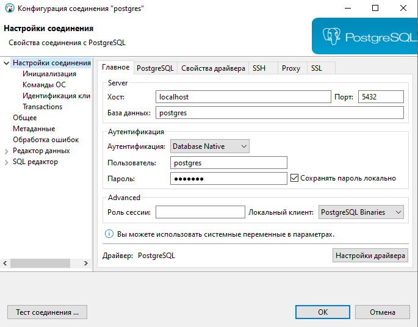
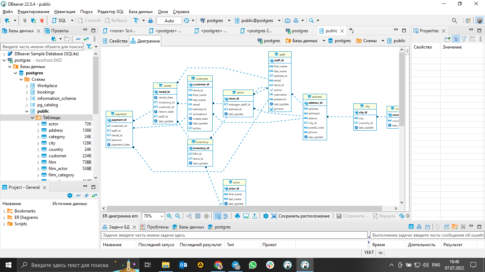
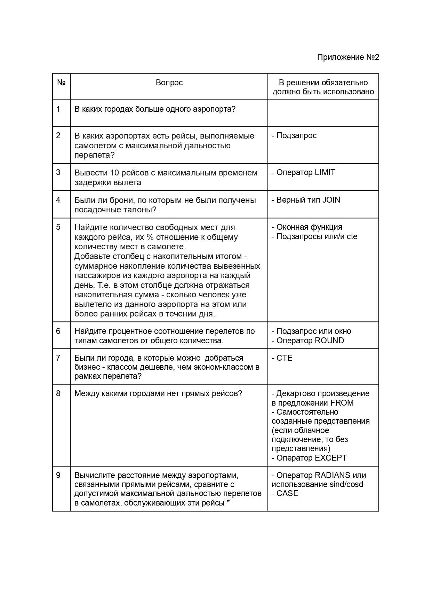

# ИТОГОВАЯ РАБОТА

## Задание

1) Перейти по ссылке и ознакомиться с описанием базы данных: https://edu.postgrespro.ru/bookings.pdf
2) Подключиться к базе данных avia по одному из следующих вариантов:
- облачное подключение, те же настройки, что и у dvd-rental, только название базы demo, схема bookings
- импорт sql запроса из sql файла, представленных на 2 странице описания базы
- восстановить базу из *.backup файла по ссылке avia
3) Оформить работу согласно “Приложения №1” в формате *.pdf или *.doc
4) Создать запросы, позволяющие ответить на вопросы из “Приложения №2”, решения должны быть приложены в формате *.sql одним файлом.
5) Отправить работу на проверку

## Решение
### Использовался локальный тип подключения 

### Скриншот ER-диаграммы из DBeaver`a согласно Вашего подключения.

### Данная БД состоит из 8 таблиц, в которые входят следующие данные:
- самолеты, с кодом, моделью и дальности полета
- аэропорты, с кодом, названием аэропорта, в каком городе находится аэропорт, их координатами и наименованием временной зоны
- посадочные талоны, с номером билета, идентификатором рейса, номером посадочного талона и номером места
- бронирование, с номером брони, ее датой и полной суммой бронирования
- полеты, с идентефикатором рейса, номером рейса, времени вылета, времени прилета, аэропорт отправления и аэропорт прибытия, статусом рейса, код самолета, факт. время вылета и факт. время прилета
- сиденье, с кодом самолета, номером места и классом обслуживания
- авиабилет, с номером билета, идентификатором рейса, классом обслуживания и стоимостью перелета
- билеты, с номером билета, номер брони, идентификатор пассажира его именем и контактными данными

### Описание схемы:
- Основной сущностью является бронирование (bookings). 
- В одно бронирование можно включить несколько пассажиров, каждому из которых выписывается отдельный билет (tickets). Билет имеет уникальный номер и содержит информацию о пассажире. Как таковой пассажир не является отдельной сущностью. Как имя, так и номер документа пассажира могут меняться с течением времени, так что невозможно однозначно найти все билеты одного человека; для простоты можно считать, что все пассажиры уникальны. 
- Билет включает один или несколько перелетов (ticket_flights). Несколько перелетов могут включаться в билет в случаях, когда нет нет прямого рейса, соединяющего пункты отправления и назначения (полет с пересадками), либо когда билет взят «туда и обратно». В схеме данных нет жесткого ограничения, но предполагается, что все билеты в одном бронировании имеют одинаковый набор перелетов. 
- Каждый рейс (flights) следует из одного аэропорта (airports) в другой. Рейсы с одним номером имеют одинаковые пункты вылета и назначения, но будут отличаться датой отправления. 
- При регистрации на рейс пассажиру выдается посадочный талон (boarding_passes), в котором указано место в самолете. Пассажир может зарегистрироваться только на тот рейс, который есть у него в билете. Комбинация рейса и места в самолете должна быть уникальной, чтобы не допустить выдачу двух посадочных талонов на одно место.
- Количество мест (seats) в самолете и их распределение по классам обслуживания зависит от модели самолета (aircrafts), выполняющего рейс. Предполагается, что каждая модель самолета имеет только одну компоновку салона. Схема данных не контролирует, что места в посадочных талонах соответствуют имеющимся в самолете (такая проверка может быть сделана с использованием табличных триггеров или в приложении).

### С помощью данной БД можно решить следующие бизнес задачи:
- Рассчитать сколько тысяч километров пассажир
- Посчитать сколько человек летело в 3 ряду у окна
- Какое количество людей летело прямым рейсом. 
- Вывести номера рейсов прибывшие ранним утром с 04:30 до 7:30
- Вывести пассажиров имя которых начинается на букву “С” летевших в бизнес классе рейсом “Москва - Санкт-Петербург”

### Список SQL запросов из приложения №2 с описанием логики их выполнения.
Ниже приведена ссылка на файл со списком запросов. Описание логики их выполнения дано в текстовом комментарии перед каждым запросом.
#### [Файл с запросами](Script-7.sql)

### Приложение №2 

